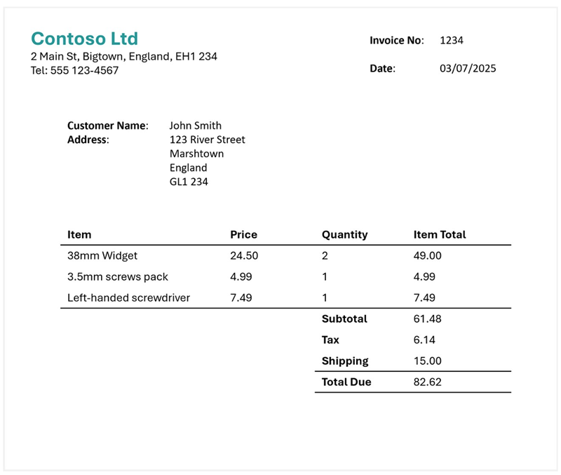
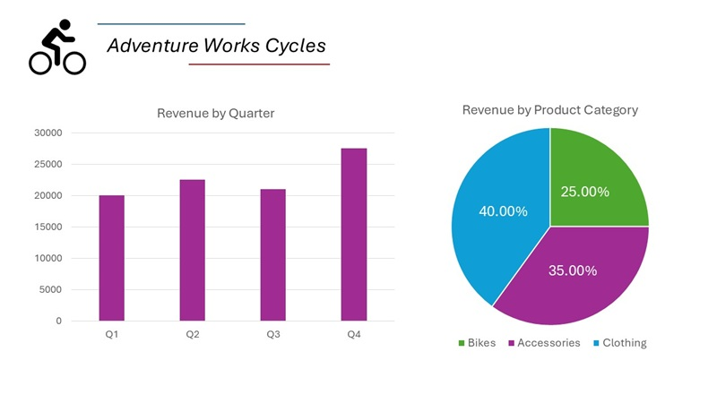
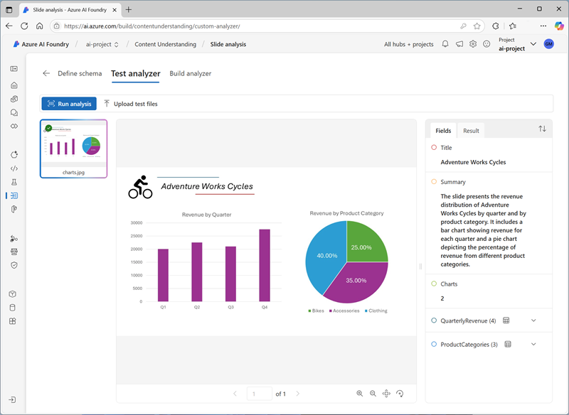
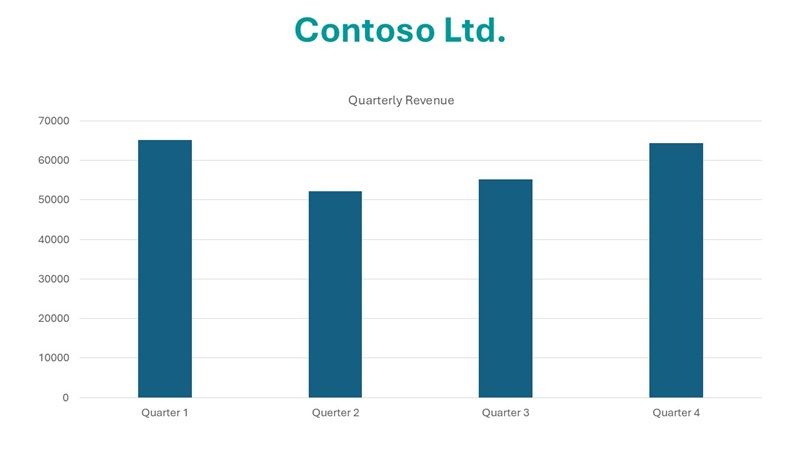
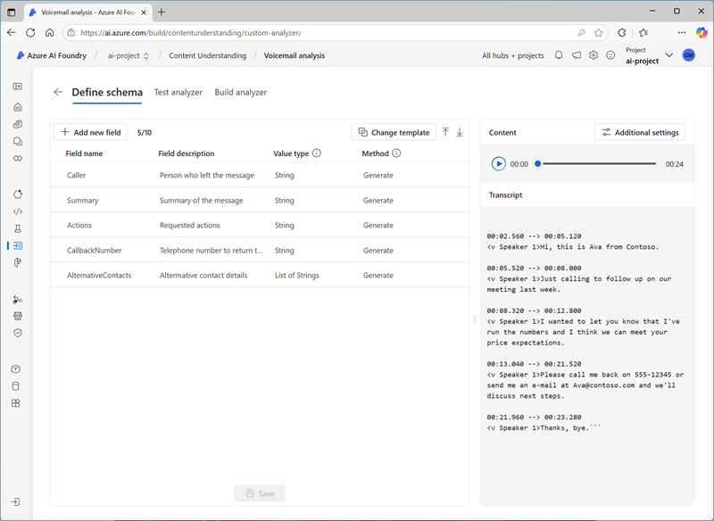
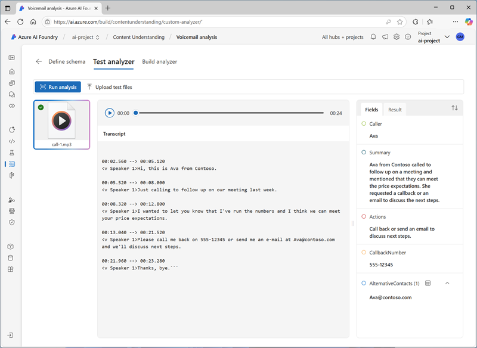

---
lab:
    title: 'Extract information from multimodal content'
    description: 'Use Azure AI Content Understanding to extract insights from documents, images, audio recordings, and videos.'
---

# Extract information from multimodal content

In this exercise, you use Azure Content Understanding to extract information from a variety of content types; including an invoice, an images of a slide containing charts, an audio recording of a voice messages, and a video recording of a conference call.

This exercise takes approximately **40** minutes.

## Create an Azure AI Foundry hub and project

The features of Azure AI Foundry we're going to use in this exercise require a project that is based on an Azure AI Foundry *hub* resource.

1. In a web browser, open the [Azure AI Foundry portal](https://ai.azure.com) at `https://ai.azure.com` and sign in using your Azure credentials. Close any tips or quick start panes that are opened the first time you sign in, and if necessary use the **Azure AI Foundry** logo at the top left to navigate to the home page, which looks similar to the following image (close the **Help** pane if it's open):

    

1. In the browser, navigate to `https://ai.azure.com/managementCenter/allResources` and select **Create**. Then choose the option to create a new **AI hub resource**.
1. In the **Create a project** wizard, enter a valid name for your project, and select the option to create a new hub. Then use the **Rename hub** link to specify a valid name for your new hub, expand **Advanced options**, and specify the following settings for your project:
    - **Subscription**: *Your Azure subscription*
    - **Resource group**: *Create or select a resource group*
    - **Region**:  Select one of the following locations (*At the time of writing, Azure AI Content understanding is only available in these regions*):
        - Australia East
        - Sweden Central
        - West US

    > **Note**: If you're working in an Azure subscription in which policies are used to restrict allowable resource names, you may need to use the link at the bottom of the **Create a new project** dialog box to create the hub using the Azure portal.

    > **Tip**: If the **Create** button is still disabled, be sure to rename your hub to a unique alphanumeric value.

1. Wait for your project to be created.

## Download content

The content you're going to analyze is in a .zip archive. Download it and extract it in a local folder.

1. In a new browser tab, download [content.zip](https://github.com/microsoftlearning/mslearn-ai-information-extraction/raw/main/Labfiles/content/content.zip) from `https://github.com/microsoftlearning/mslearn-ai-information-extraction/raw/main/Labfiles/content/content.zip` and save it in a local folder.
1. Extract the downloaded *content.zip* file and view the files it contains. You'll use these files to build various Content Understanding analyzers in this exercise.

> **Note**: If you're only interested in exploring analysis of a specific modality (documents, images, video, or audio), you can skip to the relevant task below. For the best experience, go through each task to learn how to extract information from different types of content.

## Extract information from invoice documents

You are going to build an Azure AI Content Understanding analyzer that can extract information from invoices. You'll start by defining a schema based on a sample invoice.

### Define a schema for invoice analysis

1. In the browser tab containing the home page for your Azure AI Foundry project; in the navigation pane on the left, select **Content Understanding**.
1. On the **Content Understanding** page, select the **Custom task** tab at the top.
1. On the Content Understanding custom task page, select **+ Create**, and create a task with the following settings:
    - **Task name**: `Invoice analysis`
    - **Description**: `Extract data from an invoice`
    - **Single file content analysis**: *Selected*
    - **Advanced settings**:
        - **Azure AI services connection**: *The Azure AI Services resource in your Azure AI Foundry hub*
        - **Azure Blob Storage account**: *The default storage account in your Azure AI Foundry hub*
1. Wait for the task to be created.

    > **Tip**: If an error accessing storage occurs, wait a minute and try again. Permissions for a new hub may take a few minutes to propagate.

1. On the **Define schema** page, upload the **invoice-1234.pdf** file from the folder where you extracted content files. This file contains the following invoice:

    

1. On the **Define schema** page, after uploading the invoice file, select the **Invoice data extraction** template and select **Create**.

    The *Invoice analysis* template includes common fields that are found in invoices. You can use the schema editor to delete any of the suggested fields that you don't need, and add any custom fields that you do.

1. In the list of suggested fields, select **BillingAddress**. This field is not needed for the invoice format you have uploaded, so use the **Delete field** (**&#128465;**) icon that appears in the selected field row to delete it.
1. Now delete the following suggested fields, which aren't needed for your invoice schema:
    - BillingAddressRecipient
    - CustomerAddressRecipient
    - CustomerId
    - CustomerTaxId
    - DueDate
    - InvoiceTotal
    - PaymentTerm
    - PreviousUnpaidBalance
    - PurchaseOrder
    - RemittanceAddress
    - RemittanceAddressRecipient
    - ServiceAddress
    - ServiceAddressRecipient
    - ShippingAddress
    - ShippingAddressRecipient
    - TotalDiscount
    - VendorAddressRecipient
    - VendorTaxId
    - TaxDetails
1. Use **+ Add new field** button to add the following fields, selecting **Save changes** (**&#10003;**) for each new field:

    | Field name | Field description | Value type | Method |
    |--|--|--|--|
    | `VendorPhone` | `Vendor telephone number` | String | Extract |
    | `ShippingFee` | `Fee for shipping` | Number | Extract |

1. In the row for the **Items** field, note that this field is a *table* (it contains the collection of items in the invoice). Select it's **Edit** (&#9638;) icon to open a new page with its subfields.
1. Remove the following subfields from the **Items** table:
    - Date
    - ProductCode
    - Unit
    - TaxAmount
    - TaxRate
1. Use the **OK** button to confirm the changes and return to the top-level of the invoice schema.

1. Verify that your completed schema looks like this, and select **Save**.

    

1. On the **Test Analyzer** page, if analysis does not begin automatically, select **Run analysis**. Then wait for analysis to complete.

1. Review the analysis results, which should look similar to this:

    

1. View the details of the fields that were identified in the **Fields** pane.

### Build and test an analyzer for invoices

Now that you have trained a model to extract fields from invoices, you can build an analyzer to use with similar documents.

1. Select the **Analyzer list** page, and then select **+ Build analyzer** and build a new analyzer with the following properties (typed exactly as shown here):
    - **Name**: `invoice-analyzer`
    - **Description**: `Invoice analyzer`
1. Wait for the new analyzer to be ready (use the **Refresh** button to check).
1. When the analyzer has been built, select the **invoice-analyzer** link. The fields defined in the analyzer's schema will be displayed.
1. In the **invoice-analyzer** page, select the **Test** tab.
1. Use the **+ Upload test files** button to upload **invoice-1235.pdf** from the folder where you extracted the content files, and run the analysis to extract field data from the invoice.

    The invoice being analyzed looks like this:

    

1. Review the **Fields** pane, and verify that the analyzer extracted the correct fields from the test invoice.
1. Review the **Results** pane to see the JSON response that the analyzer would return to a client application.
1. On the **Code example** tab, view the sample code that you could use to develop a client application that uses the Content Understanding REST interface to call your analyzer.
1. Close the **invoice-analyzer** page.

## Extract information from a slide image

You are going to build an Azure AI Content Understanding analyzer that can extract information from a slide containing charts.

### Define a schema for image analysis

1. In the browser tab containing the home page for your Azure AI Foundry project; in the navigation pane on the left, select **Content Understanding**.
1. On the **Content Understanding** page, select the **Custom task** tab at the top.
1. On the Content Understanding custom task page, select **+ Create**, and create a task with the following settings:
    - **Task name**: `Slide analysis`
    - **Description**: `Extract data from an image of a slide`
    - **Single file content analysis**: *Selected*
    - **Advanced settings**:
        - **Azure AI services connection**: *The Azure AI Services resource in your Azure AI Foundry hub*
        - **Azure Blob Storage account**: *The default storage account in your Azure AI Foundry hub*
1. Wait for the task to be created.

    > **Tip**: If an error accessing storage occurs, wait a minute and try again. Permissions for a new hub may take a few minutes to propagate.

1. On the **Define schema** page, upload the **slide-1.jpg** file from the folder where you extracted content files. Then select the **Image analysis** template and select **Create**.

    The *Image analysis* template doesn't include any predefined fields. You must define fields to describe the information you want to extract.

1. Use **+ Add new field** button to add the following fields, selecting **Save changes** (**&#10003;**) for each new field:

    | Field name | Field description | Value type | Method |
    |--|--|--|--|
    | `Title` | `Slide title` | String | Generate |
    | `Summary` | `Summary of the slide` | String | Generate |
    | `Charts` | `Number of charts on the slide` | Integer | Generate |

1. Use **+ Add new field** button to add a new field named `QuarterlyRevenue` with the description `Revenue per quarter` with the value type **Table**, and save the new field (**&#10003;**). Then, in the new page for the table subfields that opens, add the following subfields:

    | Field name | Field description | Value type | Method |
    |--|--|--|--|
    | `Quarter` | `Which quarter?` | String | Generate |
    | `Revenue` | `Revenue for the quarter` | Number | Generate |

1. Select **Back** to return to the top level of your schema, and use **+ Add new field** button to add a new field named `ProductCategories` with the description `Product categories` with the value type **Table**, and save the new field (**&#10003;**). Then, in the new page for the table subfields that opens, add the following subfields:

    | Field name | Field description | Value type | Method |
    |--|--|--|--|
    | `ProductCategory` | `Product category name` | String | Generate |
    | `RevenuePercentage` | `Percentage of revenue` | Number | Generate |

1. Select **Back** to return to the top level of your schema, and verify that it looks like this. Then select **Save**.

    

1. On the **Test Analyzer** page, if analysis does not begin automatically, select **Run analysis**. Then wait for analysis to complete.

    The slide being analyzed looks like this:

    

1. Review the analysis results, which should look similar to this:

    

1. View the details of the fields that were identified in the **Fields** pane, expanding the **QuarterlyRevenue** and **ProductCategories** fields to see the subfield values.

### Build and test an analyzer

Now that you have trained a model to extract fields from slides, you can build an analyzer to use with similar slide images.

1. Select the **Analyzer list** page, and then select **+ Build analyzer** and build a new analyzer with the following properties (typed exactly as shown here):
    - **Name**: `slide-analyzer`
    - **Description**: `Slide image analyzer`
1. Wait for the new analyzer to be ready (use the **Refresh** button to check).
1. When the analyzer has been built, select the **slide-analyzer** link. The fields defined in the analyzer's schema will be displayed.
1. In the **slide-analyzer** page, select the **Test** tab.
1. Use the **+ Upload test files** button to upload **slide-2.jpg** from the folder where you extracted the content files, and run the analysis to extract field data from the image.

    The slide being analyzed looks like this:

    

1. Review the **Fields** pane, and verify that the analyzer extracted the correct fields from the slide image.

    > **Note**: Slide 2 doesn't include a breakfown by product category, so the product category revenue data is not found.

1. Review the **Results** pane to see the JSON response that the analyzer would return to a client application.
1. On the **Code example** tab, view the sample code that you could use to develop a client application that uses the Content understanding REST interface to call your analyzer.
1. Close the **slide-analyzer** page.

## Extract information from a voicemail audio recording

You are going to build an Azure AI Content Understanding analyzer that can extract information from an audio recording of a voicemail message.

### Define a schema for audio analysis

1. In the browser tab containing the home page for your Azure AI Foundry project; in the navigation pane on the left, select **Content Understanding**.
1. On the **Content Understanding** page, select the **Custom task** tab at the top.
1. On the Content Understanding custom task page, select **+ Create**, and create a task with the following settings:
    - **Task name**: `Voicemail analysis`
    - **Description**: `Extract data from a voicemail recording`
    - **Single file content analysis**: *Selected*
    - **Advanced settings**:
        - **Azure AI services connection**: *The Azure AI Services resource in your Azure AI Foundry hub*
        - **Azure Blob Storage account**: *The default storage account in your Azure AI Foundry hub*
1. Wait for the task to be created.

    > **Tip**: If an error accessing storage occurs, wait a minute and try again. Permissions for a new hub may take a few minutes to propagate.

1. On the **Define schema** page, upload the **call-1.mp3** file from the folder where you extracted content files. Then select the **Speech transcript analysis** template and select **Create**.
1. In the **Content** pane on the right, select **Get transcription preview** to see a transcription of the recorded message.

    The *Speech transcript analysis* template doesn't include any predefined fields. You must define fields to describe the information you want to extract.

1. Use **+ Add new field** button to add the following fields, selecting **Save changes** (**&#10003;**) for each new field:

    | Field name | Field description | Value type | Method |
    |--|--|--|--|
    | `Caller` | `Person who left the message` | String | Generate |
    | `Summary` | `Summary of the message` | String | Generate |
    | `Actions` | `Requested actions` | String | Generate |
    | `CallbackNumber` | `Telephone number to return the call` | String | Generate |
    | `AlternativeContacts` | `Alternative contact details` | List of Strings | Generate |

1. Verify that your schema looks like this. Then select **Save**.

    

1. On the **Test Analyzer** page, if analysis does not begin automatically, select **Run analysis**. Then wait for analysis to complete.

    Audio analysis can take some time. While you're waiting, you can play the audio file below:

    <video controls src="https://github.com/MicrosoftLearning/mslearn-ai-information-extraction/raw/refs/heads/main/Instructions/Labs/media/call-1.mp4" title="Call 1" width="300">
        <track src="https://github.com/MicrosoftLearning/mslearn-ai-information-extraction/raw/refs/heads/main/Instructions/Labs/media/call-1.vtt" kind="captions" srclang="en" label="English">
    </video>

    **Note**: This audio was generated using AI.

1. Review the analysis results, which should look similar to this:

    

1. View the details of the fields that were identified in the **Fields** pane, expanding the **AlternativeContacts** field to see the listed values.

### Build and test an analyzer

Now that you have trained a model to extract fields from voice messages, you can build an analyzer to use with similar audio recordings.

1. Select the **Analyzer list** page, and then select **+ Build analyzer** and build a new analyzer with the following properties (typed exactly as shown here):
    - **Name**: `voicemail-analyzer`
    - **Description**: `Voicemail audio analyzer`
1. Wait for the new analyzer to be ready (use the **Refresh** button to check).
1. When the analyzer has been built, select the **voicemail-analyzer** link. The fields defined in the analyzer's schema will be displayed.
1. In the **voicemail-analyzer** page, select the **Test** tab.
1. Use the **+ Upload test files** button to upload **call-2.mp3** from the folder where you extracted the content files, and run the analysis to extract field data from the audio file.

    Audio analysis can take some time. While you're waiting, you can play the audio file below:

    <video controls src="https://github.com/MicrosoftLearning/mslearn-ai-information-extraction/raw/refs/heads/main/Instructions/Labs/media/call-2.mp4" title="Call 2" width="300">
        <track src="https://github.com/MicrosoftLearning/mslearn-ai-information-extraction/raw/refs/heads/main/Instructions/Labs/media/call-2.vtt" kind="captions" srclang="en" label="English">
    </video>

    **Note**: This audio was generated using AI.

1. Review the **Fields** pane, and verify that the analyzer extracted the correct fields from the voice message.
1. Review the **Results** pane to see the JSON response that the analyzer would return to a client application.
1. On the **Code example** tab, view the sample code that you could use to develop a client application that uses the Content understanding REST interface to call your analyzer.
1. Close the **voicemail-analyzer** page.

## Extract information from a video conference recording

You are going to build an Azure AI Content Understanding analyzer that can extract information from an video recording of a conference call.

### Define a schema for video analysis

1. In the browser tab containing the home page for your Azure AI Foundry project; in the navigation pane on the left, select **Content Understanding**.
1. On the **Content Understanding** page, select the **Custom task** tab at the top.
1. On the Content Understanding custom task page, select **+ Create**, and create a task with the following settings:
    - **Task name**: `Conference call video analysis`
    - **Description**: `Extract data from a video conference recording`
    - **Single file content analysis**: *Selected*
    - **Advanced settings**:
        - **Azure AI services connection**: *The Azure AI Services resource in your Azure AI Foundry hub*
        - **Azure Blob Storage account**: *The default storage account in your Azure AI Foundry hub*
1. Wait for the task to be created.

    > **Tip**: If an error accessing storage occurs, wait a minute and try again. Permissions for a new hub may take a few minutes to propagate.

1. On the **Define schema** page, upload the **meeting-1.mp4** file from the folder where you extracted content files. Then select the **Video analysis** template and select **Create**.
1. In the **Content** pane on the right, select **Get transcription preview** to see a transcription of the recorded message.

    The *Video analysis* template extracts data for the video. It doesn't include any predefined fields. You must define fields to describe the information you want to extract.

1. Use **+ Add new field** button to add the following fields, selecting **Save changes** (**&#10003;**) for each new field:

    | Field name | Field description | Value type | Method |
    |--|--|--|--|
    | `Summary` | `Summary of the discussion` | String | Generate |
    | `Participants` | `Count of meeting participants` | Integer | Generate |
    | `ParticipantNames` | `Names of meeting participants` | List of Strings | Generate |
    | `SharedSlides` | `Descriptions of any PowerPoint slides presented` | List of Strings | Generate |
    | `AssignedActions` | `Tasks assigned to participants` | Table |  |

1. When you enter the **AssignedActions** field, in the table of subfields that appears, create the following subfields:

    | Field name | Field description | Value type | Method |
    |--|--|--|--|
    | `Task` | `Description of the task` | String | Generate |
    | `AssignedTo` | `Who the task is assigned to` | String | Generate |

1. Select **&#10003; OK** to return to the top level of your schema, and verify that it looks like this. Then select **Save**.

1. Verify that your schema looks like this. Then select **Save**.

    

1. On the **Test Analyzer** page, if analysis does not begin automatically, select **Run analysis**. Then wait for analysis to complete.

    Video analysis can take some time. While you're waiting, you can view the video below:

    <video controls src="https://github.com/MicrosoftLearning/mslearn-ai-information-extraction/raw/refs/heads/main/Instructions/Labs/media/meeting-1.mp4" title="Meeting 1" width="480">
        <track src="https://github.com/MicrosoftLearning/mslearn-ai-information-extraction/raw/refs/heads/main/Instructions/Labs/media/meeting-1.vtt" kind="captions" srclang="en" label="English">
    </video>

    **Note**: This video was generated using AI.

1. When analysis is complete, review the results, which should look similar to this:

    

1. In the **Fields** pane, view the extracted data for the video, including the fields you added. View the field values that were generated, expanding list and table fields as necessary.

### Build and test an analyzer

Now that you have trained a model to extract fields from conference call recordings, you can build an analyzer to use with similar videos.

1. Select the **Analyzer list** page, and then select **+ Build analyzer** and build a new analyzer with the following properties (typed exactly as shown here):
    - **Name**: `conference-call-analyzer`
    - **Description**: `Conference call video analyzer`
1. Wait for the new analyzer to be ready (use the **Refresh** button to check).
1. When the analyzer has been built, select the **conference-call-analyzer** link. The fields defined in the analyzer's schema will be displayed.
1. In the **conference-call-analyzer** page, select the **Test** tab.
1. Use the **Upload test files** button to upload **meeting-2.mp4** from the folder where you extracted the content files, and run the analysis to extract field data from the audio file.

    Video analysis can take some time. While you're waiting, you can view the video below:

    <video controls src="https://github.com/MicrosoftLearning/mslearn-ai-information-extraction/raw/refs/heads/main/Instructions/Labs/media/meeting-2.mp4" title="Meeting 2" width="480">
        <track src="https://github.com/MicrosoftLearning/mslearn-ai-information-extraction/raw/refs/heads/main/Instructions/Labs/media/meeting-2.vtt" kind="captions" srclang="en" label="English">
    </video>

    **Note**: This video was generated using AI.

1. Review the **Fields** pane, and view the fields that the analyzer extracted for the conference call video.
1. Review the **Results** pane to see the JSON response that the analyzer would return to a client application.
1. Close the **conference-call-analyzer** page.

## Clean up

If you've finished working with the Content Understanding service, you should delete the resources you have created in this exercise to avoid incurring unnecessary Azure costs.

1. In the Azure AI Foundry portal, navigate to your project and delete it.
1. In the Azure portal, delete the resource group you created in this exercise.
