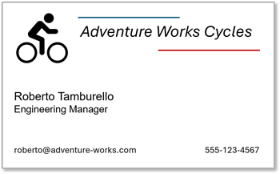

---
lab:
    title: 'Develop a Content Understanding client application'
    description: 'Use Azure AI Content Understanding REST API to develop a client app for an analyzer.'
---

# Develop a Content Understanding client application

In this exercise, you use Azure AI Content Understanding to create an analyzer that extracts information from business cards. You'll then develop a client application that uses the analyzer to extract contact details from scanned business cards.

This exercise takes approximately **30** minutes.

## Create an Azure AI Foundry hub and project

The features of Azure AI Foundry we're going to use in this exercise require a project that is based on an Azure AI Foundry *hub* resource.

1. In a web browser, open the [Azure AI Foundry portal](https://ai.azure.com) at `https://ai.azure.com` and sign in using your Azure credentials. Close any tips or quick start panes that are opened the first time you sign in, and if necessary use the **Azure AI Foundry** logo at the top left to navigate to the home page, which looks similar to the following image (close the **Help** pane if it's open):

    

1. In the browser, navigate to `https://ai.azure.com/managementCenter/allResources` and select **Create new**. Then choose the option to create a new **AI hub resource**.
1. In the **Create a project** wizard, enter a valid name for your project, and select the option to create a new hub. Then use the **Rename hub** link to specify a valid name for your new hub, expand **Advanced options**, and specify the following settings for your project:
    - **Subscription**: *Your Azure subscription*
    - **Resource group**: *Create or select a resource group*
    - **Hub name**: A valid name for your hub
    - **Location**: Choose one of the following locations:\*
        - Australia East
        - Sweden Central
        - West US

    > \*At the time of writing, Azure AI Content understanding is only available in these regions.

    > **Tip**: If the **Create** button is still disabled, be sure to rename your hub to a unique alphanumeric value.

1. Wait for your project to be created, and then navigate to your project overview page.

## Use the REST API to create a Content Understanding analyzer

You're going to use the REST API to create an analyzer that can extract information from images of business cards.

1. Open a new browser tab (keeping the Azure AI Foundry portal open in the existing tab). Then in the new tab, browse to the [Azure portal](https://portal.azure.com) at `https://portal.azure.com`; signing in with your Azure credentials if prompted.

    Close any welcome notifications to see the Azure portal home page.

1. Use the **[\>_]** button to the right of the search bar at the top of the page to create a new Cloud Shell in the Azure portal, selecting a ***PowerShell*** environment with no storage in your subscription.

    The cloud shell provides a command-line interface in a pane at the bottom of the Azure portal. You can resize or maximize this pane to make it easier to work in.

    > **Tip**: Resize the pane so you can work mostly in the cloud shell but still see the keys and endpoint in the Azure portal page - you'll need to copy them into your code.

1. In the cloud shell toolbar, in the **Settings** menu, select **Go to Classic version** (this is required to use the code editor).

    **<font color="red">Ensure you've switched to the classic version of the cloud shell before continuing.</font>**

1. In the cloud shell pane, enter the following commands to clone the GitHub repo containing the code files for this exercise (type the command, or copy it to the clipboard and then right-click in the command line and paste as plain text):

    ```
   rm -r mslearn-ai-info -f
   git clone https://github.com/microsoftlearning/mslearn-ai-information-extraction mslearn-ai-info
    ```

    > **Tip**: As you enter commands into the cloudshell, the output may take up a large amount of the screen buffer. You can clear the screen by entering the `cls` command to make it easier to focus on each task.

1. After the repo has been cloned, navigate to the folder containing the code files for your app:

    ```
   cd mslearn-ai-info/Labfiles/content-app
   ls -a -l
    ```

    The folder contains two scanned business card images as well as the Python code files you need to build your app.

1. In the cloud shell command-line pane, enter the following command to install the libraries you'll use:

    ```
   python -m venv labenv
   ./labenv/bin/Activate.ps1
   pip install -r requirements.txt
    ```

1. Enter the following command to edit the configuration file that has been provided:

    ```
   code .env
    ```

    The file is opened in a code editor.

1. In the code file, replace the **YOUR_ENDPOINT** and **YOUR_KEY** placeholders with the your Azure AI services endpoint and either of its keys (copied from the Azure portal), and ensure that **ANALYZER_NAME** is set to `business-card-analyzer`.
1. After you've replaced the placeholders, within the code editor, use the **CTRL+S** command to save your changes and then use the **CTRL+Q** command to close the code editor while keeping the cloud shell command line open.

    > **Tip**: You can maximize the cloud shell pane now.

1. In the cloud shell command line, enter the following command to view the **biz-card.json** JSON file that has been provided:

    ```
   cat biz-card.json
    ```

    Scroll the cloud shell pane to view the JSON in the file, which defines an analyzer schema for a business card.

1. When you've viewed the JSON file for the analyzer, enter the following command to edit the **create-analyzer.py** Python code file that has been provided:

    ```
   code create-analyzer.py
    ```

    The Python code file is opened in a code editor.

1. Review the code, which:
    - Loads the analyzer schema from **biz-card.json** file.
    - Retrieves the endpoint, key, and analyzer name from the environment configuration file.
    - Calls a function named **create_analyzer**, which is currently not implemented

1. In the **create_analyzer** function, find the comment **Create a Content Understanding analyzer** and add the following code (being careful to maintain the correct indentation):

    ```python
   # Create a Content Understanding analyzer
   print (f"Creating {analyzer}")

   # Set the API version
   CU_VERSION = "2025-05-01-preview"

   # initiate the analyzer creation operation
   headers = {
        "Ocp-Apim-Subscription-Key": key,
        "Content-Type": "application/json"}

   url = f"{endpoint}/contentunderstanding/analyzers/{analyzer}?api-version={CU_VERSION}"

   # Delete the analyzer if it already exists
   response = requests.delete(url, headers=headers)
   print(response.status_code)
   time.sleep(1)

   # Now create it
   response = requests.put(url, headers=headers, data=(schema))
   print(response.status_code)

   # Get the response and extract the callback URL
   callback_url = response.headers["Operation-Location"]

   # Check the status of the operation
   time.sleep(1)
   result_response = requests.get(callback_url, headers=headers)

   # Keep polling until the operation is no longer running
   status = result_response.json().get("status")
   while status == "Running":
        time.sleep(1)
        result_response = requests.get(callback_url, headers=headers)
        status = result_response.json().get("status")

   result = result_response.json().get("status")
   print(result)
   if result == "Succeeded":
        print(f"Analyzer '{analyzer}' created successfully.")
   else:
        print("Analyzer creation failed.")
        print(result_response.json())
    ```

1. Review the code you added, which:
    - Creates appropriate headers for the REST requests
    - Submits an HTTP *DELETE* request to delete the analyzer if it already exists.
    - Submits an HTTP *PUT* request to initiate the creation of the analyzer.
    - Checks the response to retrieve the *Operation-Location* callback URL.
    - Repeatedly submits an HTTP *GET* request to the callback URL to check the operation status until it is no longer running.
    - Confirms success (or failure) of the operation to the user.

    > **Note**: The code includes some deliberate time delays to avoid exceeding the request rate limit foe the service.

1. Use the **CTRL+S** command to save the code changes, but keep the code editor pane open in case you need to correct any errors in the code. Resize the panes so you can clearly see the command line pane.
1. In the cloud shell command line pane, enter the following command to run the Python code:

    ```
   python create-analyzer.py
    ```

1. Review the output from the program, which should hopefully indicate that the analyzer has been created.

## Use the REST API to analyze content

Now that you've created an analyzer, you can consume it from a client application through the Content Understanding REST API.

1. In the cloud shell command line, enter the following command to edit the **read-card.py** Python code file that has been provided:

    ```
   code read-card.py
    ```

    The Python code file is opened in a code editor:

1. Review the code, which:
    - Identifies the image file to be analyzed, with a default of **biz-card-1.png**.
    - Retrieves the endpoint and key for your Azure AI Services resource from the project (using the Azure credentials from the current cloud shell session to authenticate).
    - Calls a function named **analyze_card**, which is currently not implemented

1. In the **analyze_card** function, find the comment **Use Content Understanding to analyze the image** and add the following code (being careful to maintain the correct indentation):

    ```python
   # Use Content Understanding to analyze the image
   print (f"Analyzing {image_file}")

   # Set the API version
   CU_VERSION = "2025-05-01-preview"

   # Read the image data
   with open(image_file, "rb") as file:
        image_data = file.read()
    
   ## Use a POST request to submit the image data to the analyzer
   print("Submitting request...")
   headers = {
        "Ocp-Apim-Subscription-Key": key,
        "Content-Type": "application/octet-stream"}
   url = f'{endpoint}/contentunderstanding/analyzers/{analyzer}:analyze?api-version={CU_VERSION}'
   response = requests.post(url, headers=headers, data=image_data)

   # Get the response and extract the ID assigned to the analysis operation
   print(response.status_code)
   response_json = response.json()
   id_value = response_json.get("id")

   # Use a GET request to check the status of the analysis operation
   print ('Getting results...')
   time.sleep(1)
   result_url = f'{endpoint}/contentunderstanding/analyzerResults/{id_value}?api-version={CU_VERSION}'
   result_response = requests.get(result_url, headers=headers)
   print(result_response.status_code)

   # Keep polling until the analysis is complete
   status = result_response.json().get("status")
   while status == "Running":
        time.sleep(1)
        result_response = requests.get(result_url, headers=headers)
        status = result_response.json().get("status")

   # Process the analysis results
   if status == "Succeeded":
        print("Analysis succeeded:\n")
        result_json = result_response.json()
        output_file = "results.json"
        with open(output_file, "w") as json_file:
            json.dump(result_json, json_file, indent=4)
            print(f"Response saved in {output_file}\n")

        # Iterate through the fields and extract the names and type-specific values
        contents = result_json["result"]["contents"]
        for content in contents:
            if "fields" in content:
                fields = content["fields"]
                for field_name, field_data in fields.items():
                    if field_data['type'] == "string":
                        print(f"{field_name}: {field_data['valueString']}")
                    elif field_data['type'] == "number":
                        print(f"{field_name}: {field_data['valueNumber']}")
                    elif field_data['type'] == "integer":
                        print(f"{field_name}: {field_data['valueInteger']}")
                    elif field_data['type'] == "date":
                        print(f"{field_name}: {field_data['valueDate']}")
                    elif field_data['type'] == "time":
                        print(f"{field_name}: {field_data['valueTime']}")
                    elif field_data['type'] == "array":
                        print(f"{field_name}: {field_data['valueArray']}")
    ```

1. Review the code you added, which:
    - Reads the contents of the image file
    - Sets the version of the Content Understanding REST API to be used
    - Submits an HTTP *POST* request to your Content Understanding endpoint, instructing the to analyze the image.
    - Checks the response from the operation to retrieve an ID for the analysis operation.
    - Repeatedly submits an HTTP *GET* request to your Content Understanding endpoint to check the operation status until it is no longer running.
    - If the operation has succeeded, saves the JSON response, and then parses the JSON and displays the values retrieved for each type-specific field.

    > **Note**: In our simple business card schema, all of the fields are strings. The code here illustrates the need to check the type of each field so that you can extract values of different types from a more complex schema.

1. Use the **CTRL+S** command to save the code changes, but keep the code editor pane open in case you need to correct any errors in the code. Resize the panes so you can clearly see the command line pane.
1. In the cloud shell command line pane, enter the following command to run the Python code:

    ```
   python read-card.py biz-card-1.png
    ```

1. Review the output from the program, which should show the values for the fields in the following business card:

    

1. Use the following command to run the program with a different business card:

    ```
   python read-card.py biz-card-2.png
    ```

1. Review the results, which should reflect the values in this business card:

    

1. In the cloud shell command line pane, use the following command to view the full JSON response that was returned:

    ```
   cat results.json
    ```

    Scroll to view the JSON.

## Clean up

If you've finished working with the Content Understanding service, you should delete the resources you have created in this exercise to avoid incurring unnecessary Azure costs.

1. In the Azure portal, delete the resources you created in this exercise.
