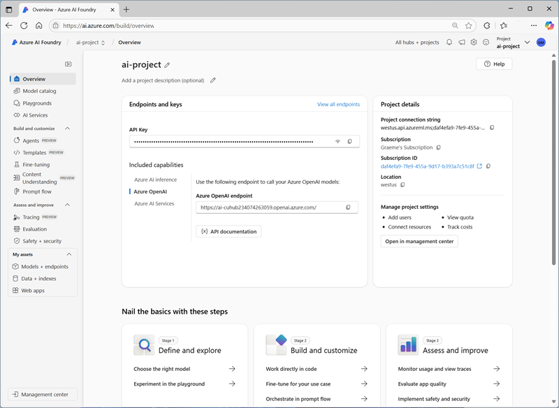

---
lab:
    title: 'Analyze forms with prebuilt Azure AI Document Intelligence models'
    description: 'Use prebuilt Azure AI Document Intelligence models to process text fields from documents.'
---

# Analyze forms with prebuilt Azure AI Document Intelligence models

In this exercise, you'll set up an Azure AI Foundry project with all the necessary resources for document analysis. You'll use both the Azure AI Foundry and C# or Python to submit forms to that resource for analysis.

## Create an Azure AI Foundry project

Let's start by creating an Azure AI Foundry project.

1. In a web browser, open the [Azure AI Foundry portal](https://ai.azure.com) at `https://ai.azure.com` and sign in using your Azure credentials. Close any tips or quick start panes that are opened the first time you sign in, and if necessary use the **Azure AI Foundry** logo at the top left to navigate to the home page, which looks similar to the following image (close the **Help** pane if it's open):

    

1. In the browser, navigate to `https://ai.azure.com/managementCenter/allResources` and select **Create**. Then choose the option to create a new **AI hub resource**.
1. In the **Create a project** wizard, enter a valid name for your project, and select the option to create a new hub. Then use the **Rename hub** link to specify a valid name for your new hub, expand **Advanced options**, and specify the following settings for your project:
    - **Subscription**: *Your Azure subscription*
    - **Resource group**: *Create or select a resource group*
    - **Region**:  *Any available region*

    > **Note**: If you're working in an Azure subscription in which policies are used to restrict allowable resource names, you may need to use the link at the bottom of the **Create a new project** dialog box to create the hub using the Azure portal.

    > **Tip**: If the **Create** button is still disabled, be sure to rename your hub to a unique alphanumeric value.

1. Wait for your project to be created.
1. When your project is created, close any tips that are displayed and review the project page in Azure AI Foundry portal, which should look similar to the following image:

    

## Use the Read model

Let's start by using the **Azure AI Foundry** portal and the Read model to analyze a document with multiple languages:

1. In the navigation panel on the left, select **AI Services**.
1. In the **Azure AI Services** page, select the **Vision + Document** tile.
1. In the **Vision + Document** page, verify that the **Document** tab is selected, then select the **OCR/Read** tile.

    In the **Read** page, the Azure AI Services resource created with your project should already be connected.

1. In the list of documents on the left, select **read-german.pdf**.

    

1. At the top toolbar, select **Analyze options**, then enable the **Language** check-box (under **Optional detection**) in the **Analyze options** pane and select **Save**. 
1. At the top-left, select **Run Analysis**.
1. When the analysis is complete, the text extracted from the image is shown on the right in the **Content** tab. Review this text and compare it to the text in the original image for accuracy.
1. Select the **Result** tab. This tab displays the extracted JSON code. 

## Prepare to develop an app in Cloud Shell

Now let's explore the app that uses the Azure Document Intelligence service SDK. You'll develop your app using Cloud Shell. The code files for your app have been provided in a GitHub repo.

Applications for both C# and Python have been provided, as well as a sample pdf file you'll use to test Document Intelligence. Both apps feature the same functionality. First, you'll complete some key parts of the application to enable using your Azure Document Intelligence resource.

This is the invoice that your code will analyze.


1. In the Azure AI Foundry portal, view the **Overview** page for your project.
1. In the **Endpoints and keys** area, select the **Azure AI Services** tab, and note the **API Key** and **Azure AI Services endpoint**. You'll use these credentials to connect to your Azure AI Services in a client application.
1. Open a new browser tab (keeping the Azure AI Foundry portal open in the existing tab). Then in the new tab, browse to the [Azure portal](https://portal.azure.com) at `https://portal.azure.com`; signing in with your Azure credentials if prompted.
1. Use the **[\>_]** button to the right of the search bar at the top of the page to create a new Cloud Shell in the Azure portal, selecting a ***PowerShell*** environment. The cloud shell provides a command line interface in a pane at the bottom of the Azure portal.

    > **Note**: If you have previously created a cloud shell that uses a *Bash* environment, switch it to ***PowerShell***.

1. In the cloud shell toolbar, in the **Settings** menu, select **Go to Classic version** (this is required to use the code editor).

    **<font color="red">Ensure you've switched to the classic version of the cloud shell before continuing.</font>**

1. In the PowerShell pane, enter the following commands to clone the GitHub repo for this exercise:

    ```
   rm -r mslearn-ai-info -f
   git clone https://github.com/microsoftlearning/mslearn-ai-information-extraction mslearn-ai-info
    ```

    > **Tip**: As you paste commands into the cloudshell, the ouput may take up a large amount of the screen buffer. You can clear the screen by entering the `cls` command to make it easier to focus on each task.

    ***Now follow the steps for your chosen programming language.***

1. After the repo has been cloned, navigate to the folder containing the code files:

   **Python**

    ```
   cd mslearn-ai-info/Labfiles/prebuilt-doc-intelligence/Python
    ```

    **C#**

    ```
   cd mslearn-ai-info/Labfiles/prebuilt-doc-intelligence/c-sharp
    ```

1. In the cloud shell command line pane, enter the following command to install the libraries you'll use:

   **Python**

    ```
   python -m venv labenv
   ./labenv/bin/Activate.ps1
   pip install -r requirements.txt azure-ai-formrecognizer==3.3.3
    ```

    **C#**

    ```
   dotnet add package Azure.AI.FormRecognizer --version 4.1.0
    ```

1. Enter the following command to edit the configuration file that has been provided:

    **Python**

    ```
   code .env
    ```

    **C#**

    ```
   code appsettings.json
    ```
    

    The file is opened in a code editor.

1. In the code file, replace the **YOUR_ENDPOINT** and **YOUR_KEY** placeholders with your Azure AI services endpoint and its API key (copied from the Azure AI Foundry portal).
1. After you've replaced the placeholders, within the code editor, use the **CTRL+S** command to save your changes and then use the **CTRL+Q** command to close the code editor while keeping the cloud shell command line open.

## Add code to use the Azure Document Intelligence service

Now you're ready to use the SDK to evaluate the pdf file.

1. Enter the following command to edit the app file that has been provided:

    **Python**

    ```
   code document-analysis.py
    ```

    **C#**

    ```
   code Program.cs
    ```

    The file is opened in a code editor.

1. In the code file, find the comment **Import the required libraries** and add the following code:

    **Python**

    ```python
   # Add references
   from azure.core.credentials import AzureKeyCredential
   from azure.ai.formrecognizer import DocumentAnalysisClient
    ```

    **C#**

    ```csharp
   // Add references
   using Azure.AI.FormRecognizer.DocumentAnalysis;
    ```

1. Find the comment **Create the client** and add the following code (being careful to maintain the correct indentation level):

    **Python**

    ```python
   # Create the client
   document_analysis_client = DocumentAnalysisClient(
        endpoint=endpoint, credential=AzureKeyCredential(key)
   )
    ```

    **C#**

    ```csharp
   // Create the client
   var cred = new AzureKeyCredential(key);
   var client = new DocumentAnalysisClient(new Uri(endpoint), cred);
    ```

1. Find the comment **Analyze the invoice** and add the following code:

    **Python**

    ```python
   # Analyse the invoice
   poller = document_analysis_client.begin_analyze_document_from_url(
        fileModelId, fileUri, locale=fileLocale
   )
    ```

    **C#**

    ```csharp
   // Analyse the invoice
   AnalyzeDocumentOperation operation = await client.AnalyzeDocumentFromUriAsync(
        WaitUntil.Completed,
        "prebuilt-invoice", fileUri);
    ```

1. Find the comment **Display invoice information to the user**and add the following code:

    **Python**

    ```python
   # Display invoice information to the user
   receipts = poller.result()
    
   for idx, receipt in enumerate(receipts.documents):
    
        vendor_name = receipt.fields.get("VendorName")
        if vendor_name:
            print(f"\nVendor Name: {vendor_name.value}, with confidence {vendor_name.confidence}.")

        customer_name = receipt.fields.get("CustomerName")
        if customer_name:
            print(f"Customer Name: '{customer_name.value}, with confidence {customer_name.confidence}.")


        invoice_total = receipt.fields.get("InvoiceTotal")
        if invoice_total:
            print(f"Invoice Total: '{invoice_total.value.symbol}{invoice_total.value.amount}, with confidence {invoice_total.confidence}.")
    ```

   **C#**

    ```csharp
   // Display invoice information to the user
   AnalyzeResult result = operation.Value;
    
   foreach (AnalyzedDocument invoice in result.Documents)
   {
        if (invoice.Fields.TryGetValue("VendorName", out DocumentField? vendorNameField))
        {
            if (vendorNameField.FieldType == DocumentFieldType.String)
            {
                string vendorName = vendorNameField.Value.AsString();
                Console.WriteLine($"Vendor Name: '{vendorName}', with confidence {vendorNameField.Confidence}.");
            }
        }

        if (invoice.Fields.TryGetValue("CustomerName", out DocumentField? customerNameField))
        {
            if (customerNameField.FieldType == DocumentFieldType.String)
            {
                string customerName = customerNameField.Value.AsString();
                Console.WriteLine($"Customer Name: '{customerName}', with confidence {customerNameField.Confidence}.");
            }
        }

        if (invoice.Fields.TryGetValue("InvoiceTotal", out DocumentField? invoiceTotalField))
        {
            if (invoiceTotalField.FieldType == DocumentFieldType.Currency)
            {
                CurrencyValue invoiceTotal = invoiceTotalField.Value.AsCurrency();
                Console.WriteLine($"Invoice Total: '{invoiceTotal.Symbol}{invoiceTotal.Amount}', with confidence {invoiceTotalField.Confidence}.");
            }
        }
   }
    ```


1. In the code editor, use the **CTRL+S** command or **Right-click > Save** to save your changes. Keep the code editor open in case you need to fix any errors in the code, but resize the panes so you can see the command line pane clearly.

1. In the command line pane, enter the following command to run the application.

    **Python**:

    ```
    python document-analysis.py
    ```

    **C#**:

    ```
    dotnet run
    ```

The program displays the vendor name, customer name, and invoice total with confidence levels. Compare the values it reports with the sample invoice you opened at the start of this section.

## Clean up

If you're done with your Azure resource, remember to delete the resource in the [Azure portal](https://portal.azure.com) (`https://portal.azure.com`) to avoid further charges.
