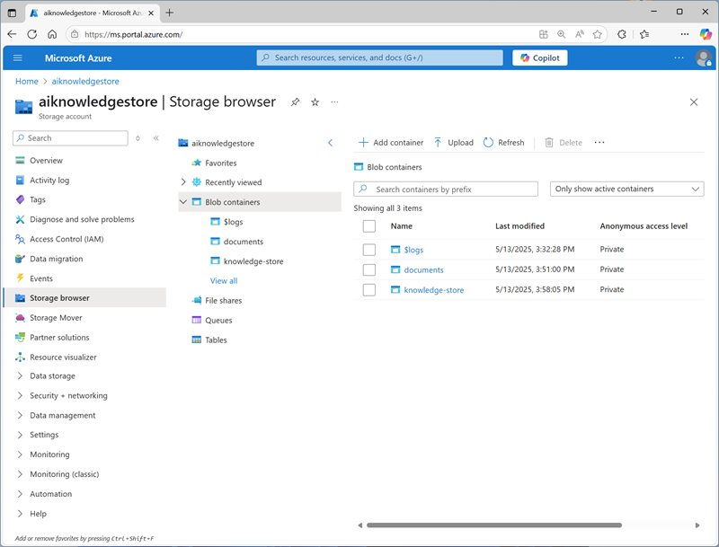

---
lab:
    title: 'Create an knowledge mining solution'
    description: 'Use Azure AI Search to extract key information from documents and make it easier to search and analyze.'
---

# Create an knowledge mining solution

In this exercise, you use AI Search to index a set of documents maintained by Margie's Travel, a fictional travel agency. The indexing process involves using AI skills to extract key information to make them searchable, and generating a knowledge store containing data assets for further analysis.

This exercise takes approximately **40** minutes.

## Create Azure resources

The solution you will create for Margie's Travel requires multiple resources in your Azure subscription. In this exercise, you'll create them directly in the Azure portal. You could also create them by using a script, or an ARM or BICEP template; or you could create an Azure AI Foundry project that includes an Azure AI Search resource.

> **Important**: Your Azure resources should be created in the same location!

### Create an Azure AI Search resource

1. In a web browser, open the Azure portal at `https://portal.azure.com`, and sign in using your Azure credentials.
1. Select the **&#65291;Create a resource** button, search for `Azure AI Search`, and create an **Azure AI Search** resource with the following settings:
    - **Subscription**: *Your Azure subscription*
    - **Resource group**: *Create or select a resource group*
    - **Service name**: *A valid name for your search resource*
    - **Location**: *Any available location*
    - **Pricing tier**: Free

1. Wait for deployment to complete, and then go to the deployed resource.
1. Review the **Overview** page on the blade for your Azure AI Search resource in the Azure portal. Here, you can use a visual interface to create, test, manage, and monitor the various components of a search solution; including data sources, indexes, indexers, and skillsets.

### Create a storage account

1. Return to the home page, and then create a **Storage account** resource with the following settings:
    - **Subscription**: *Your Azure subscription*
    - **Resource group**: *The same resource group as your Azure AI Search and Azure AI Services resources*
    - **Storage account name**: *A valid name for your storage resource*
    - **Region**: *The same region as your Azure AI Search resource*
    - **Primary service**: Azure Blob Storage or Azure Data Lake Storage Gen 2
    - **Performance**: Standard
    - **Redundancy**: Locally-redundant storage (LRS)

1. Wait for deployment to complete, and then go to the deployed resource.

    > **Tip**: Keep the storage account portal page open - you will use it in the next procedure.

## Create storage containers

Your knowledge mining solution will use two storage containers:

- One to store the source documents that your solution will index.
- One to store the extracted knowledge assets generated by the indexing process.

### Create a container for source documents

1. In a new browser tab, download [documents.zip](https://github.com/microsoftlearning/mslearn-ai-information-extraction/raw/main/Labfiles/knowledge/documents.zip) from `https://github.com/microsoftlearning/mslearn-ai-information-extraction/raw/main/Labfiles/knowledge/documents.zip` and save it in a local folder.
1. Extract the downloaded *documents.zip* file and view the **collateral** and **reviews**  subfolders it contains. You'll extract and index information from the files in these subfolders in this exercise.
1. In the browser tab containing the Azure portal page for your storage account, in the navigation pane on the left, select **Storage browser**.
1. In the storage browser, select **Blob containers**.

    Currently, your storage account should contain only the default **$logs** container.

1. In the toolbar, select **+ Container** and create a new container with the following settings:
    - **Name**: `documents`
    - **Anonymous access level**: Private (no anonymous access)\*

    > **Note**: \*Unless you enabled the option to allow anonymous container access when creating your storage account, you won't be able to select any other setting!

1. Select the **documents** container to open it, and then use the **Upload** toolbar button to upload the **collateral** and **reviews** folders you extracted from **documents.zip** previously.

### Create a container for extracted knowledge assets

1. In the storage browser navigation tree pane, return to the **Blob containers** node - you should see the **$logs** container and your new **documents** container.
1. Add a new container named **knowledge-store**.

    The storage browser should show both of your containers, like this:

    

## Prepare to develop an app in Cloud Shell

You'll develop your search app using Azure cloud shell. The code files for your app have been provided in a GitHub repo.

1. Use the **[\>_]** button to the right of the search bar at the top of the page to create a new Cloud Shell in the Azure portal, selecting a ***PowerShell*** environment with no storage in your subscription.

    The cloud shell provides a command-line interface in a pane at the bottom of the Azure portal. You can resize or maximize this pane to make it easier to work in.

    > **Note**: If you have previously created a cloud shell that uses a *Bash* environment, switch it to ***PowerShell***.

1. In the cloud shell toolbar, in the **Settings** menu, select **Go to Classic version** (this is required to use the code editor).

    **<font color="red">Ensure you've switched to the classic version of the cloud shell before continuing.</font>**

## Create and run an indexer

Now that you have the documents in place, you can create an indexer to extract information from them.

1. In the Azure portal, browse to your Azure AI Search resource. Then, on its **Overview** page, select **Import data**.
1. On the **Connect to your data** page, in the **Data Source** list, select **Azure Blob Storage**. Then complete the data store details with the following values:
    - **Data Source**: Azure Blob Storage
    - **Data source name**: `margies-documents`
    - **Data to extract**: Content and metadata
    - **Parsing mode**: Default
    - **Subscription**: *Your Azure subscription*
    - **Connection string**: 
        - Select **Choose an existing connection**
        - Select your storage account
        - Select the **documents** container
    - **Managed identity authentication**: None
    - **Container name**: documents
    - **Blob folder**: *Leave this blank*
    - **Description**: `Collateral and reviews`
1. Proceed to the next step (**Add cognitive skills**).
1. In the **Attach Azure AI Services** section, select **Free (limited enrichments**)\*.

    > **Note**: \*The free Azure AI Services resource for Azure AI Search can be used to index a maximum of 20 documents. In a real solution, you should create an Azure AI Services resource in your subscription to enable AI enrichment for a larger number of documents.

1. In the **Add enrichments** section:
    - Change the **Skillset name** to `margies-skillset`.
    - Select the option **Enable OCR and merge all text into merged_content field**.
    - Ensure that the **Source data field** is set to **merged_content**.
    - Leave the **Enrichment granularity level** as **Source field**, which is set the entire contents of the document being indexed; but note that you can change this to extract information at more granular levels, like pages or sentences.
    - Select the following enriched fields:

        | Cognitive Skill | Parameter | Field name |
        | --------------- | ---------- | ---------- |
        | **Text Cognitive Skills** | |  |
        | Extract location names | | locations |
        | Extract key phrases | | keyphrases |
        | Detect language | | language |
        | **Image Cognitive Skills** | |  |
        | Generate tags from images | | imageTags |
        | Generate captions from images | | imageCaption |

        Double-check your selections (it can be difficult to change them later).

1. In the **Save enrichments to a knowledge store** section:
    - Select the following checkboxes (an <font color="red">error</font> will be displayed, you'll resolve that shortly):
        - **Azure file projections**:
            - Image projections
        - **Azure table projections**:
            - Documents
                - Key phrases
                - Entities
        - **Azure blob projections**:
            - Document
    <!-- Test these settings - seems to create container for images (sometimes)! -->
    - Under **Storage account connection string** (beneath the <font color="red">error messages</font>):
        - Select **Choose an existing connection**
        - Select your storage account
        - Select the **knowledge-store** container
    - Ensure the **Container name** box now contains **knowledge-store**.
1. Proceed to the next step (**Customize target index**). 
1. Change the **Index name** to `margies-index`.
1. Ensure that the **Key** is set to **metadata_storage_path**, leave the **Suggester name** blank, and ensure **Search mode** is **analyzingInfixMatching**.
1. Make the following changes to the index fields, leaving all other fields with their default settings (**IMPORTANT**: you may need to scroll to the right to see the entire table):

    | Field name | Retrievable | Filterable | Sortable | Facetable | Searchable |
    | ---------- | ----------- | ---------- | -------- | --------- | ---------- |
    | metadata_storage_size | &nbsp;&nbsp;&nbsp;&nbsp;&nbsp;&nbsp;&#10004; | &nbsp;&nbsp;&nbsp;&nbsp;&nbsp;&nbsp;&#10004; | &nbsp;&nbsp;&nbsp;&nbsp;&nbsp;&nbsp;&#10004; | | |
    | metadata_storage_last_modified | &nbsp;&nbsp;&nbsp;&nbsp;&nbsp;&nbsp;&#10004; | &nbsp;&nbsp;&nbsp;&nbsp;&nbsp;&nbsp;&#10004; | &nbsp;&nbsp;&nbsp;&nbsp;&nbsp;&nbsp;&#10004; | | |
    | metadata_storage_name | &nbsp;&nbsp;&nbsp;&nbsp;&nbsp;&nbsp;&#10004; | &nbsp;&nbsp;&nbsp;&nbsp;&nbsp;&nbsp;&#10004; | &nbsp;&nbsp;&nbsp;&nbsp;&nbsp;&nbsp;&#10004; | | &nbsp;&nbsp;&nbsp;&nbsp;&nbsp;&nbsp;&#10004; |
    | metadata_author | &nbsp;&nbsp;&nbsp;&nbsp;&nbsp;&nbsp;&#10004; | &nbsp;&nbsp;&nbsp;&nbsp;&nbsp;&nbsp;&#10004; | &nbsp;&nbsp;&nbsp;&nbsp;&nbsp;&nbsp;&#10004; | &nbsp;&nbsp;&nbsp;&nbsp;&nbsp;&nbsp;&#10004; | &nbsp;&nbsp;&nbsp;&nbsp;&nbsp;&nbsp;&#10004; |
    | locations | &nbsp;&nbsp;&nbsp;&nbsp;&nbsp;&nbsp;&#10004; | &nbsp;&nbsp;&nbsp;&nbsp;&nbsp;&nbsp;&#10004; | | | &nbsp;&nbsp;&nbsp;&nbsp;&nbsp;&nbsp;&#10004; |
    | keyphrases | &nbsp;&nbsp;&nbsp;&nbsp;&nbsp;&nbsp;&#10004; | &nbsp;&nbsp;&nbsp;&nbsp;&nbsp;&nbsp;&#10004; | | | &nbsp;&nbsp;&nbsp;&nbsp;&nbsp;&nbsp;&#10004; |
    | language | &nbsp;&nbsp;&nbsp;&nbsp;&nbsp;&nbsp;&#10004; | &nbsp;&nbsp;&nbsp;&nbsp;&nbsp;&nbsp;&#10004; | | | &nbsp;&nbsp;&nbsp;&nbsp;&nbsp;&nbsp;&#10004; |

    Double-check your selections, paying particular attention to ensure that the correct **Retrievable**, **Filterable**, **Sortable**, **Facetable**, and **Searchable** options are selected correctly for each field  (it can be difficult to change them later).

1. Proceed to the next step (**Create an indexer**).
1. Change the **Indexer name** to `margies-indexer`.
1. Leave the **Schedule** set to **Once**.
1. Select **Submit** to create the data source, skillset, index, and indexer. The indexer is run automatically and runs the indexing pipeline, which:
    - Extracts the document metadata fields and content from the data source
    - Runs the skillset of cognitive skills to generate additional enriched fields
    - Maps the extracted fields to the index.
    - Saves the extracted data assets to the knowledge store.
1. In the navigation pane on the left, expand **Search management** and view the **Indexers** page, which should show the newly created **margies-indexer**. Wait a few minutes, and click **&orarr; Refresh** until the **Status** indicates **Success**.

    <details>
    <summary><b>Troubleshooting tip</b>: Failed indexer</summary><br>
    <p>If your indexer fails to create an index, you need to manually add a field mapping function:</p>
    <ol>
        <li>Select <b>margies-indexer</b> and then select <b>Edit JSON</b>.</li>
        <li>In the <code>fieldMappings</code> field, add the following function:.</li>
        <code>"fieldMappings": [
       {
           "sourceFieldName": "metadata_storage_path",
           "targetFieldName": "metadata_storage_path",
           "mappingFunction": {
               "name": "base64Encode"
           }
       }],</code>
        <li>Select <b>Save</b> and then run the indexer again.</li>
    </ol>
    </details>

## Search the index

Now that you have an index, you can search it.

1. Return to the **Overview** page for your Azure AI Search resource, and on the toolbar, select **Search explorer**.
1. In Search explorer, in the **Query string** box, enter `*` (a single asterisk), and then select **Search**.

    This query retrieves all documents in the index in JSON format. Examine the results and note the fields for each document, which contain document content, metadata, and enriched data extracted by the cognitive skills you selected.

1. In the **View** menu, select **JSON view** and note that the JSON request for the search is shown, like this:

    ```json
    {
      "search": "*",
      "count": true
    }
    ```

1. The results include a **@odata.count** field at the top of the results that indicates the number of documents returned by the search.

1. Modify the JSON request to include the **select** parameter as shown here:

    ```json
    {
      "search": "*",
      "count": true,
      "select": "metadata_storage_name,metadata_author,locations"
    }
    ```

    This time the results include only the file name, author, and any locations mentioned in the document content. The file name and author are in the **metadata_storage_name** and **metadata_author** fields, which were extracted from the source document. The **locations** field was generated by a cognitive skill.

1. Now try the following query string:

    ```json
    {
      "search": "New York",
      "count": true,
      "select": "metadata_storage_name,keyphrases"
    }
    ```

    This search finds documents that mention "New York" in any of the searchable fields, and returns the file name and key phrases in the document.

1. Let's try one more query:

    ```json
    {
      "search": "New York",
      "count": true,
      "select": "metadata_storage_name",
      "filter": "metadata_author eq 'Reviewer'"
    }
    ```

    This query returns the filename of any documents authored by *Reviewer* that mention "New York".

## Create a search client application

Now that you have a useful index, you can use it from a client application. You can do this by consuming the REST interface, submitting requests and receiving responses in JSON format over HTTP; or you can use the software development kit (SDK) for your preferred programming language. In this exercise, we'll use the SDK.

> **Note**: You can choose to use the SDK for either **C#** or **Python**. In the steps below, perform the actions appropriate for your preferred language.

### Get the endpoint and keys for your search resource

1. In the Azure portal, on the **Overview** page for your Azure AI Search resource, note the **Url** value, which should be similar to **https://*your_resource_name*.search.windows.net**. This is the endpoint for your search resource.
1. On the **Keys** page, note that there are two **admin** keys, and a single **query** key. An *admin* key is used to create and manage search resources; a *query* key is used by client applications that only need to perform search queries.

    *You will need the endpoint and query key for your client application.*

### Prepare to use the Azure AI Search SDK

1. Use the **[\>_]** button to the right of the search bar at the top of the Azure portal to create a new Cloud Shell in the Azure portal, selecting a ***PowerShell*** environment with no storage in your subscription.

    The cloud shell provides a command-line interface in a pane at the bottom of the Azure portal. You can resize or maximize this pane to make it easier to work in.

1. In the cloud shell toolbar, in the **Settings** menu, select **Go to Classic version** (this is required to use the code editor).

    **<font color="red">Ensure you've switched to the classic version of the cloud shell before continuing.</font>**

1. In the cloud shell pane, enter the following commands to clone the GitHub repo containing the code files for this exercise (type the command, or copy it to the clipboard and then right-click in the command line and paste as plain text):

    ```
   rm -r mslearn-ai-info -f
   git clone https://github.com/microsoftlearning/mslearn-ai-information-extraction mslearn-ai-info
    ```

    > **Tip**: As you enter commands into the cloudshell, the output may take up a large amount of the screen buffer. You can clear the screen by entering the `cls` command to make it easier to focus on each task.

1. After the repo has been cloned, navigate to the folder containing the code files for your preferred programming language:

    **Python**:

    ```
   cd mslearn-ai-info/Labfiles/knowledge/python
   ls -a -l
    ```

    **C#**

    ```
   cd mslearn-ai-info/Labfiles/knowledge/c-sharp
   ls -a -l
    ```

1. Install the Azure AI Search SDK package by running the appropriate command for your language preference:

    **Python**

    ```
   python -m venv labenv
   ./labenv/bin/Activate.ps1
   pip install -r requirements.txt azure-search-documents==11.5.1
    ```

    **C#**

    ```
   dotnet add package Azure.Search.Documents --version 11.6.0
    ```

1. Run the following command to edit the configuration file for your app:

    **Python**

    ```
   code .env
    ```

    **C#**

    ```
   code appsettings.json
    ```

    <!-- CREATE A SIMPLER CONSOLE APP -->    
    ***!!!   Exercise incomplete !!!***

## View the knowledge store

<!-- test this with different settings -->

After you have run an indexer that uses a skillset to create a knowledge store, the enriched data extracted by the indexing process is persisted in the knowledge store projections.

### View object projections

The *object* projections defined in the Margie's Travel skillset consist of a JSON file for each indexed document. These files are stored in a blob container in the Azure Storage account specified in the skillset definition.

1. In the Azure portal, view the Azure Storage account you created previously.
1. Select the **Storage browser** tab (in the pane on the left) to view the storage account in the storage explorer interface in the Azure portal.
1. Expand **Blob containers** to view the containers in the storage account. In addition to the **margies** container where the source data is stored, there should be two new containers: **margies-images** and **margies-knowledge**. These were created by the indexing process.
1. Select the **margies-knowledge** container. It should contain a folder for each indexed document.
1. Open any of the folders, and then download and open the **knowledge-projection.json** file it contains. Each JSON file contains a representation of an indexed document, including the enriched data extracted by the skillset as shown here.

    ```json
    {
        "metadata_storage_content_type": "application/pdf",
        "metadata_storage_size": 388622,
        "<more_metadata_fields>": "...",
        "key_phrases":[
            "Margie’s Travel",
            "Margie's Travel",
            "best travel experts",
            "world-leading travel agency",
            "international reach"
            ],
        "locations":[
            "Dubai",
            "Las Vegas",
            "London",
            "New York",
            "San Francisco"
            ],
        "image_tags":[
            "outdoor",
            "tree",
            "plant",
            "palm"
            ]
    }
    ```

The ability to create *object* projections like this enables you to generate enriched data objects that can be incorporated into an enterprise data analysis solution - for example by ingesting the JSON files into an Azure Data Factory pipeline for further processing or loading into a data warehouse.

### View file projections

The *file* projections defined in the skillset create JPEG files for each image that was extracted from the documents during the indexing process.

1. In the *Storage browser* interface in the Azure portal, select the **margies-images** blob container. This container contains a folder for each document that contained images.
2. Open any of the folders and view its contents - each folder contains at least one \*.jpg file.
3. Open any of the image files to verify that they contain images extracted from the documents.

The ability to generate *file* projections like this makes indexing an efficient way to extract embedded images from a large volume of documents.

### View table projections

The *table* projections defined in the skillset form a relational schema of enriched data.

1. In the *Storage browser* interface in the Azure portal, expand **Tables**.
2. Select the **docs** table to view its columns. The columns include some standard Azure Storage table columns - to hide these, modify the **Column Options** to select only the following columns:
    - **document_id** (the key column automatically generated by the indexing process)
    - **file_id** (the encoded file URL)
    - **file_name** (the file name extracted from the document metadata)
    - **language** (the language in which the document is written)
    - **sentiment** the sentiment score calculated for the document.
    - **url** the URL for the document blob in Azure storage.
3. View the other tables that were created by the indexing process:
    - **ImageTags** (contains a row for each individual image tag with the **document_id** for the document in which the tag appears).
    - **KeyPhrases** (contains a row for each individual key phrase with the **document_id** for the document in which the phrase appears).
    - **Locations** (contains a row for each individual location with the **document_id** for the document in which the location appears).

The ability to create *table* projections enables you to build analytical and reporting solutions that query the relational schema; for example, using Microsoft Power BI. The automatically generated key columns can be used to join the tables in queries - for example to return all of the locations mentioned in a specific document.

## Clean-up

Now that you've completed the exercise, delete all the resources you no longer need. Delete the Azure resources:

1. In the Azure portal, select **Resource groups**.
1. Select the resource group you don't need, then select **Delete resource group**.

## More information

To learn more about Azure AI Search, see the [Azure AI Search documentation](https://docs.microsoft.com/azure/search/search-what-is-azure-search).
